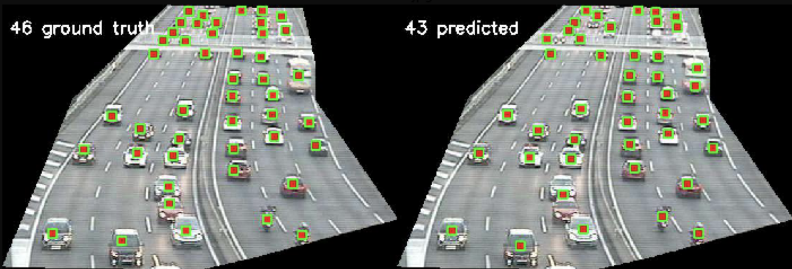
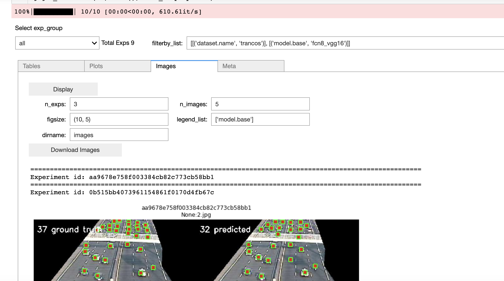

*ServiceNow completed its acquisition of Element AI on January 8, 2021. All references to Element AI in the materials that are part of this project should refer to ServiceNow.*

# LCFCN - ECCV 2018 [(Try in a Colab)](https://colab.research.google.com/drive/10NxrkOWKq_r0g91T84NrAqqlTakrsD7U?usp=sharing)

## Where are the Blobs: Counting by Localization with Point Supervision
[[Paper]](https://arxiv.org/abs/1807.09856)[[Video]](https://youtu.be/DHKD8LGvX6c)

Make the segmentation model learn to count and localize objects by adding a single line of code. Instead of applying the cross-entropy loss on dense per-pixel labels, apply the lcfcn loss on point-level annotations.


## Usage

```
pip install git+https://github.com/ElementAI/LCFCN
```

```python
from lcfcn import lcfcn_loss

# compute an CxHxW logits mask using any segmentation model
logits = seg_model.forward(images)

# compute loss given 'points' as HxW mask (1 pixel label per object)
loss = lcfcn_loss.compute_loss(points=points, probs=logits.sigmoid())

loss.backward()
```
## Predicted Object Locations




## Experiments

### 1. Install dependencies

```
pip install -r requirements.txt
```
This command installs pydicom and the [Haven library](https://github.com/haven-ai/haven-ai) which helps in managing the experiments.


### 2. Download Datasets

- Shanghai Dataset
  
  https://www.dropbox.com/s/kqqkl0exfshsw8v/mcnn_shtechB_110.h5?dl=1&fbclid=IwAR2LxhLqdyfEQx6olkTIUy-chTMhOzqMLQKcPErSTmiM5LhmeBnnGltIqVY
- Trancos Dataset 
  ```
  wget http://agamenon.tsc.uah.es/Personales/rlopez/data/trancos/TRANCOS_v3.tar.gz
  ```
<!-- 
#### Model
- Shanghai: `curl -L https://www.dropbox.com/sh/pwmoej499sfqb08/AABY13YraHYF51yw62Zc1w0-a?dl=0 `
- Trancos: `curl -L https://www.dropbox.com/sh/rms4dg5autwtpnf/AADQBOr1ruFsptbqG_uPt_zCa?dl=0` -->

### 3. Train and Validate
```
python trainval.py -e trancos -d <datadir> -sb <savedir_base> -r 1
```

- `<datadir>` is where the dataset is located.
- `<savedir_base>` is where the experiment weights and results will be saved.
- `-e trancos` specifies the trancos training hyper-parameters defined in [`exp_configs.py`](exp_configs.py).

###  4. View Results
#### 3.1 Launch Jupyter from terminal

```
> jupyter nbextension enable --py widgetsnbextension --sys-prefix
> jupyter notebook
```

####  3.2 Run the following from a Jupyter cell
```python
from haven import haven_jupyter as hj
from haven import haven_results as hr

try:
    %load_ext google.colab.data_table
except:
    pass

# path to where the experiments got saved
savedir_base = <savedir_base>

# filter exps
filterby_list = None
# get experiments
rm = hr.ResultManager(savedir_base=savedir_base, 
                      filterby_list=filterby_list, 
                      verbose=0)
# dashboard variables
title_list = ['dataset', 'model']
y_metrics = ['val_mae']

# launch dashboard
hj.get_dashboard(rm, vars(), wide_display=True)
```

This script outputs the following dashboard


## Citation 
If you find the code useful for your research, please cite:

```bibtex
@inproceedings{laradji2018blobs,
  title={Where are the blobs: Counting by localization with point supervision},
  author={Laradji, Issam H and Rostamzadeh, Negar and Pinheiro, Pedro O and Vazquez, David and Schmidt, Mark},
  booktitle={Proceedings of the European Conference on Computer Vision (ECCV)},
  pages={547--562},
  year={2018}
}
```
